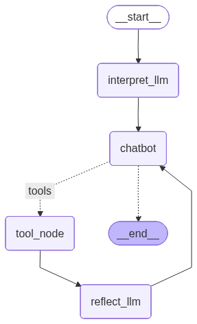

# 🤖 多智能体编排系统 (LangGraph_ReflexGraph)

基于 LangGraph 构建的多智能体编排系统，具备需求分析、任务规划、动态子Agent调度和执行反思诊断能力。

## 📋 功能特性

- **需求分析师**：自动解析用户意图，生成结构化的需求思考
- **主控Agent**：负责任务规划、工具调用决策、结果聚合
- **动态子Agent**：根据任务需求自动装配工具，异步执行子任务
- **反思诊断**：审查执行轨迹，检测错误、死循环和目标偏离
- **Token统计**：实时追踪消耗，自动生成可视化报告
- **人类交互**：支持中断-恢复的人机协作模式

## 🏗️ 工作流程

```
用户输入
    ↓
interpret_llm (需求分析师 - 分析意图)
    ↓
chatbot (主Agent - 任务规划/工具调用)
    ↓
tool_node (工具执行) ←→ reflect_llm (反思诊断)
    ↓
输出结果
```

## 🛠️ 内置工具

| 工具 | 说明 |
|------|------|
| `search_web` | Tavily网络搜索 |
| `fetch_url` | 获取网页内容 |
| `calculate` | 安全数学计算 |
| `get_today_date` | 获取当前日期 |
| `read_from_file` | 读取文件 |
| `write_to_file` | 写入文件 |
| `append_to_file` | 追加内容到文件 |
| `get_listdir` | 列出目录文件 |
| `ask_human` | 向人类提问（支持中断恢复） |
| `call_api` | 通用API调用 |
| `create_sub_agent` | 动态调度子Agent |

## 🚀 快速开始

### 1. 安装依赖

```bash
pip install langgraph langchain langchain-core langchain-openai langchain-tavily python-dotenv numexpr pandas matplotlib seaborn requests chardet
```

### 2. 配置环境变量

在项目根目录创建 `.env` 文件：

```env
LLM_API_KEY=你的API密钥
LLM_BASE_URL=你的API地址
LLM_MODEL_ID=模型名称
TAVILY_API_KEY=你的Tavily密钥
```

### 3. 运行

```bash
python LangGraph练习.py
```

## 📁 文件说明

| 文件 | 说明 |
|------|------|
| `LangGraph练习.py` | 主程序，LangGraph状态图定义 |
| `my_tools.py` | 工具定义（搜索、文件操作、计算等） |
| `tools_set.py` | 工具集合与动态子Agent调度 |
| `my_prompt.py` | 所有Prompt模板 |
| `utils.py` | Token统计工具函数 |
| `csv_Visualization.py` | Token消耗可视化报告生成 |

## 💡 使用示例

启动后直接输入问题：

```
> 帮我分析一下今天北京的天气
> 计算 (123 + 456) * 789
> 搜索最新的AI发展趋势
> 退出
```

### 命令说明

| 命令 | 说明 |
|------|------|
| `exit` | 退出程序 |
| `<<1` | 回退到上一步状态 |

## 📊 Token统计

程序运行时会自动记录每次调用的Token消耗到 `my_token_costs.csv`。

生成可视化报告：

```bash
python csv_Visualization.py
```

生成 `token_analysis_report.png`，包含：
- Token消耗时间趋势
- 各角色消耗对比
- 高消耗任务排行
- 输出消耗分布

## ⚙️ 系统配置

### Prompt模板

在 `my_prompt.py` 中可修改：

| 变量 | 说明 |
|------|------|
| `one_prompt` | 主Agent系统提示词（含工作流程定义） |
| `sub_prompt` | 子Agent系统提示词 |
| `interpret_bot_prompt` | 需求分析师提示词 |
| `reflect_prompt` | 反思诊断提示词 |

### 工具扩展

在 `my_tools.py` 中添加新工具：

```python
@tool(description="工具描述")
def my_tool(param: str) -> str:
    """工具说明"""
    return "结果"
```

工具会自动被扫描注册到工具集中。
---

## Graph Visualization


